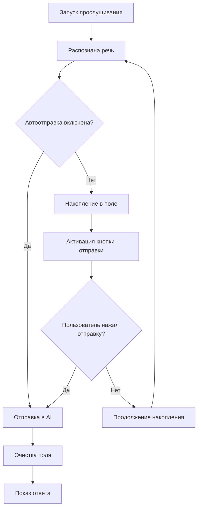

# Руководство по системе транскрипции

## ✨ Новые возможности

Система теперь поддерживает накопление и обработку транскрипции речи с гибким контролем отправки в AI.

### 🎤 Секция транскрипции речи

#### Компоненты:

- **Статус транскрипции** - показывает текущее состояние (готов, слушает, обрабатывает)
- **Поле накопления** - здесь накапливается распознанная речь
- **Тоггл автоотправки** - включает/выключает автоматическую отправку в AI
- **Кнопка отправки** - ручная отправка накопленного текста в AI
- **Кнопка очистки** - очищает накопленную транскрипцию

### 🔄 Режимы работы

#### Автоматический режим (по умолчанию)

- ✅ Тоггл "🤖 Автоотправка в AI" **включен**
- Каждая распознанная фраза сразу отправляется в AI
- Поле транскрипции очищается после каждого ответа
- Кнопка "🚀 Отправить в AI" **неактивна**

#### Ручной режим

- ❌ Тоггл "🤖 Автоотправка в AI" **выключен**
- Распознанная речь накапливается в поле транскрипции
- Кнопка "🚀 Отправить в AI" становится **активной**
- Можно накопить несколько фраз и отправить одним запросом
- Кнопка "🗑️ Очистить" позволяет очистить поле без отправки

### 📊 Индикация состояния

#### Статусы транскрипции:

- **Готов к прослушиванию** (синий) - система готова
- **🎤 Слушаю...** (зеленый) - идет запись речи
- **Обрабатываем речь...** (желтый) - распознавание в процессе
- **Готово к отправке** (синий) - текст готов для ручной отправки
- **Отправляем в AI...** (желтый) - запрос отправлен в AI
- **Ответ получен!** (зеленый) - ответ от AI получен
- **Ошибка отправки** (красный) - произошла ошибка

#### Визуальные индикаторы:

- Поле транскрипции подсвечивается когда содержит текст
- Кнопки активируются/деактивируются в зависимости от состояния
- Главная кнопка прослушивания меняет текст и цвет

### ⚙️ Логика работы

### 🎯 Преимущества

#### Автоматический режим:

- ✅ Быстрые ответы на каждую фразу
- ✅ Подходит для быстрых вопросов
- ✅ Минимум действий пользователя

#### Ручной режим:

- ✅ Контроль над отправкой
- ✅ Накопление контекста
- ✅ Редактирование перед отправкой
- ✅ Экономия запросов к AI

### 🔧 Использование

#### Для быстрых вопросов:

1. Убедитесь что автоотправка включена (по умолчанию)
2. Нажмите "▶️ Начать прослушивание"
3. Говорите вопрос
4. Получайте мгновенный ответ

#### Для сложных запросов:

1. Выключите тоггл "🤖 Автоотправка в AI"
2. Нажмите "▶️ Начать прослушивание"
3. Произнесите несколько связанных фраз
4. Проверьте накопленный текст
5. Нажмите "🚀 Отправить в AI"

#### Для исправления ошибок:

1. Выключите автоотправку
2. Произнесите фразу
3. Если есть ошибки распознавания - нажмите "🗑️ Очистить"
4. Повторите запись или воспользуйтесь ручным вводом

### 🎮 Горячие клавиши

Остались прежними:

- `Ctrl+Shift+H` - показать/скрыть окно
- `Ctrl+Shift+F12` - экстренное скрытие
- `Ctrl+Shift+C` - очистить историю

### 💡 Советы

1. **Для интервью**: используйте ручной режим чтобы сформулировать полный вопрос
2. **Для быстрых справок**: оставьте автоматический режим
3. **При плохом распознавании**: выключайте автоотправку и проверяйте текст
4. **Для экономии токенов**: накапливайте несколько вопросов в ручном режиме
